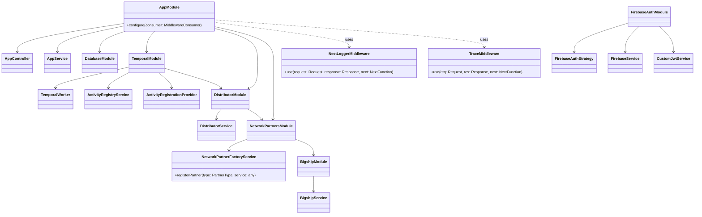

# Class Diagram - Distributor Service

```mermaid
classDiagram

    %% Main Application Module
    class AppModule {
        +configure(consumer: MiddlewareConsumer)
    }
    class AppController
    class AppService

    %% Distributor Module
    class DistributorModule
    class DistributorService

    %% Network Partners Module
    class NetworkPartnersModule
    class NetworkPartnerFactoryService {
        +registerPartner(type: PartnerType, service: any)
    }
    class BigshipService
    class BigshipModule

    %% Temporal Module
    class TemporalModule
    class TemporalWorker
    class ActivityRegistryService
    class ActivityRegistrationProvider

    %% Database Module
    class DatabaseModule

    %% Authentication Module
    class FirebaseAuthModule
    class FirebaseAuthStrategy
    class FirebaseService
    class CustomJwtService

    %% Middleware
    class NestLoggerMiddleware {
        +use(request: Request, response: Response, next: NextFunction)
    }
    class TraceMiddleware {
        +use(req: Request, res: Response, next: NextFunction)
    }

    %% Relationships
    AppModule --> AppController
    AppModule --> AppService
    AppModule --> DatabaseModule
    AppModule --> TemporalModule
    AppModule --> DistributorModule
    AppModule --> NetworkPartnersModule

    DistributorModule --> DistributorService
    DistributorModule --> NetworkPartnersModule

    NetworkPartnersModule --> NetworkPartnerFactoryService
    NetworkPartnersModule --> BigshipModule
    BigshipModule --> BigshipService

    TemporalModule --> TemporalWorker
    TemporalModule --> ActivityRegistryService
    TemporalModule --> ActivityRegistrationProvider
    TemporalModule --> DistributorModule

    FirebaseAuthModule --> FirebaseAuthStrategy
    FirebaseAuthModule --> FirebaseService
    FirebaseAuthModule --> CustomJwtService

    %% Middleware Relationships
    AppModule ..> NestLoggerMiddleware : uses
    AppModule ..> TraceMiddleware : uses
```